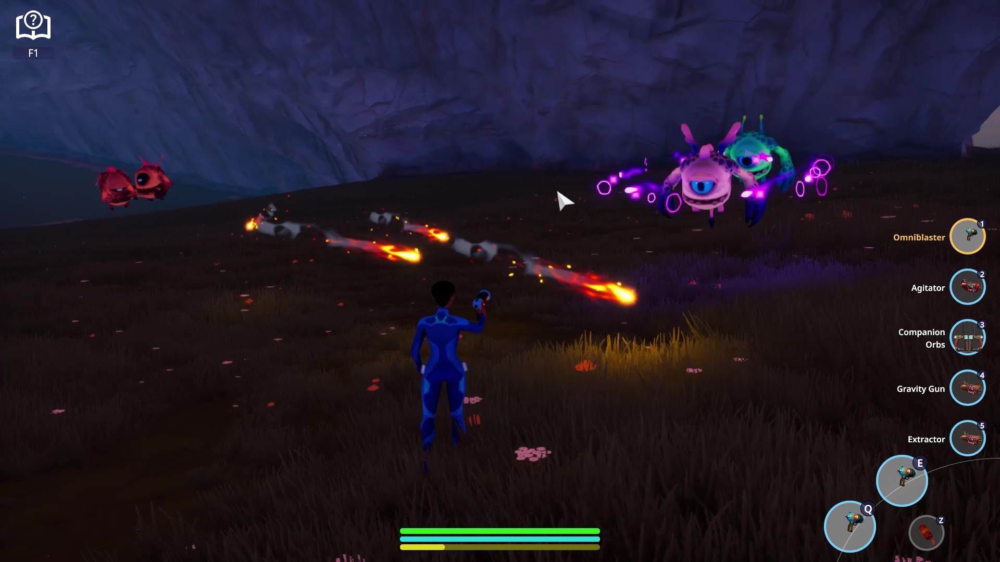

# Vivian Giacobbi's Portfolio

Technical designer and programmer with 6+ years of experience seeking senior-level design position on action-oriented and sandbox games.

## Gameplay Scripting

### Core Combat Loop

The core combat loop of Playable World's untitled MMO took inspiration from fast-action arcade games of the 1980s and 1990s, in stark contrast to the tab targeting MMOs of the past 20 years. Player characters can freely run, fly, and dodge to counter enemies.

https://github.com/VivianGiacobbi/portfolio/blob/main/Giacobbi%20-%20Powerups.mp4

As technical designer, I led development on the core combat functionality. I also personally owned and created the powerups system (seen above), resource tables, and item collection to highlight and reward active gameplay

### Aggro Tooling

https://github.com/VivianGiacobbi/portfolio/blob/main/Giacobbi%20-%20Aggro%20Tooling.mp4

Developer tooling I created at Playable Worlds in order to debug enemy aggro. As product owner of the aggro system that drove our game's combat, I oversaw constant iteration of how enemies perceived players in our living world and wanted to provide other developers easy visibility on how enemies make combat choices.

This version of the system allows players to fall out of aggro by distance and avoiding aggro-performing actions like damage and status effects. The tool shows the player's position in an enemy's list of threats, as well as the distance and idle period remaining for a player to be completely forgotten

### Procedural Boss Encounters

https://github.com/VivianGiacobbi/portfolio/blob/main/Giacobbi%20-%20Spawner%20Gameplay.mp4

To fulfill our mission statement of "creating the most living world in gaming", we experimented with boss encounters to capture the feeling of MMO raid mechnics while allowing us to procedurally spawn them upon creating new worlds.Not only do the enemy spawners (video above) act to sustain the ecology of a world by creating new creatures to inhabit it, they are also dangerous foes. Players must discover them, fend off guarding sentries, and coordinate to hack outlying weak points that power their shields. 

As lead on these encounters, I created various levels of difficulty scaling to allow our developers to tune fights. Spawners could spawn varying numbers of hackable points, create variable size waves of defending enemies when threatened, cloak themselves, and even fire their own procedurally generated attacks at players.

### Crafting Loop

https://github.com/VivianGiacobbi/portfolio/blob/main/Giacobbi%20-%20Resource%20Scanning%201.mp4

https://github.com/VivianGiacobbi/portfolio/blob/main/Giacobbi%20-%20Resource%20Scanning%202.mp4

Resource collection and crafting are core tenants of Playable World's MMO, and nearly every surface and object in the world is harvestable for resource units. Leveraging our proprietary technology, I created player harvesting tools to tunnel through the world and terraform planets to the players' whims.

https://github.com/VivianGiacobbi/portfolio/blob/main/Giacobbi%20-%20Tree%20Growth%20and%20Harvesting.mp4

We also enabled players to collect more distinct props, which share resource tags with terrain to make them as reactive as our underlying terrain.

https://github.com/VivianGiacobbi/portfolio/blob/main/Giacobbi%20-%20Crafting%20Loop.mp4

All materials that the player collects can be used in a crafting system to provide them stronger tools, more interesting gameplay mechanics, and collectables to help sustain them in combat.

## Downloadable Prototypes

// to be updated
## 🚀 About Me
I'm Vivian Giacobbi, a technical designer based out of Nashville, Tennessee. My primary experience lies with networked action games and single-player puzzle games.

